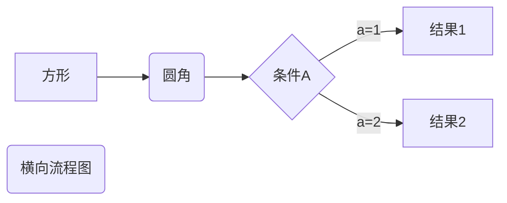
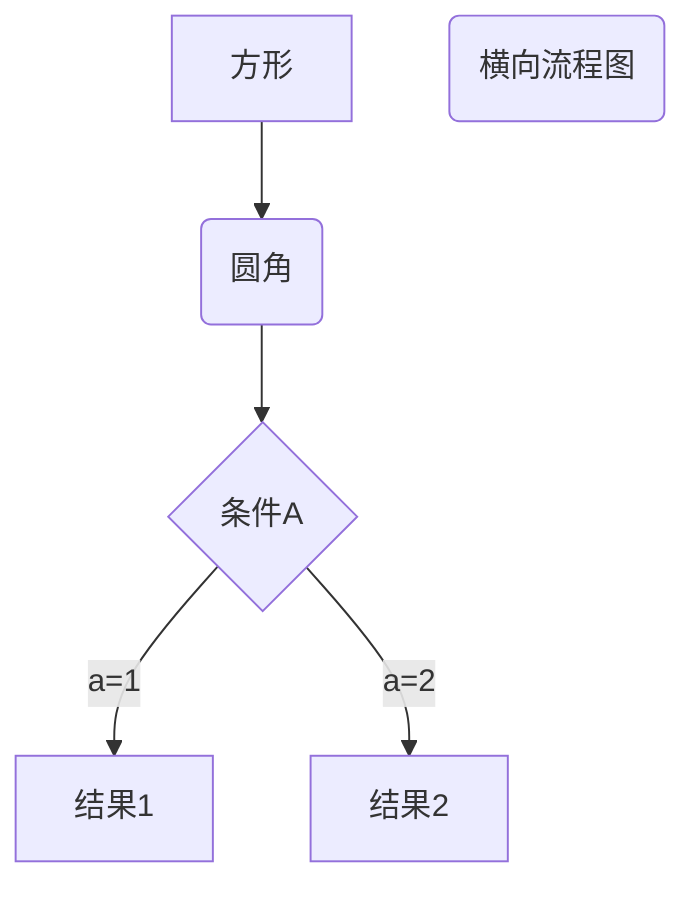
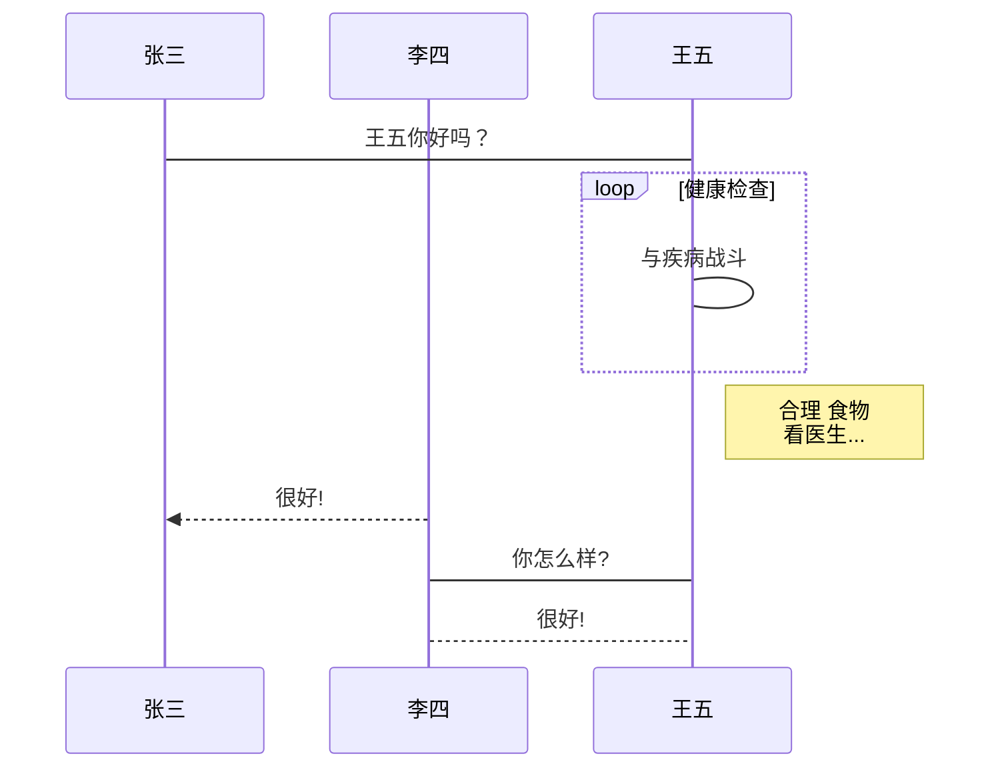
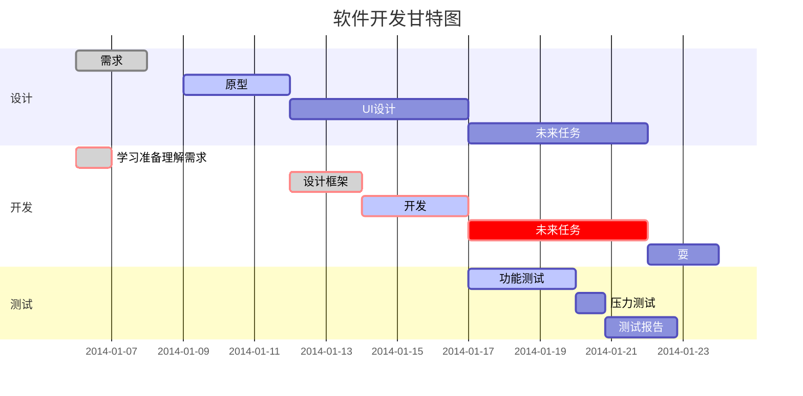

# markdown 语法总结

# 标题

```markdown
# //一级标题, 记得#后面有空格
## //二级标题
### //三级标题
......最多六级标题
```

```html
<h1>标题1</h1>
<h2>标题2</h2>
<!-- 最多到<h6> -->
<p>段落</p>
```

# 字体

1. markdown语法

```markdown
*斜体*          _斜体_ 
**粗体**       __粗体__
***粗斜体***   ___粗斜体___
```

2. HTLM语法

```html
<b>粗体</b>  <i>斜体</i> <em>着重文字</em> <small>小号字</small> <strong>加重语气</strong>
<sub>下标字</sub> <sup>上标字</sup> <ins>插入字</ins> <del>删除字</del>  
<code>一段电脑代码 print("hello world")</code>
```

<b>粗体</b> <i>斜体</i> <em>着重文字</em>  <small>小号字</small>  <strong>加重语气</strong>  <sub>下标字</sub>  <sup>上标字</sup>   <ins>插入字</ins>  <del>删除字</del>

<code>一段电脑代码 print("hello world")</code>

## css渲染

> css可以通过以下方式添加到HTML中
>
> - 内联方式: 在HTML元素中使用`style`属性
> - 内部样式表: 在HTML文档头部`<head>`区域使用 `<style>`元素来包含css
> - 外部引用: 使用外部css文件

### 内联样式

当特殊样式需要运用到个别元素时,就可以使用内联样式

```html
<p style="color:blue;margin-left:20px;">这是一个段落。</p>
```
<p style="color:blue;margin-left:20px;">这是一个段落。</p>

<table border="2px">
    <caption style="text-align:center;">style 属性</caption>
    <tr>
        <th style="text-align:center;">属性</th>
        <th style="text-align:center;">参数</th>
        <th style="text-align:center;">属性</th>
        <th style="text-align:center;">参数</th>
    </tr>
    <tr>
    	<td style="text-align:center;">color</td>
        <td style="text-align:center;">red,blue,yellow...</td>
        <td style="text-align:center;">margin-left</td>
        <td style="text-align:center;">20px(左空两格)</td>
    </tr>
    <tr>
    	<td style="text-align:center;">font-family</td>
        <td style="text-align:center;">字体样式...</td>
        <td style="text-align:center;">font-size</td>
        <td style="text-align:center;">字体大小定义(单位px)...</td>
    </tr>
        <tr>
    	<td style="text-align:center;">text-align</td>
        <td style="text-align:center;">center,left,right</td>
        <td style="text-align:center;">background-color</td>
        <td style="text-align:center;">red,green,blue...</td>
    </tr>
</table>


### 内部样式表

当单个文件需要特别样式时,可以使用内部样式表,你可以在`<head>`部分通过`<style>`标签定义内部样式表

```css
<head>
<style type="text/css">
body {background-color:yellow;}
p {color:blue;}
</style>
</head>
```

### 外部样式表

当样式需要被应用到很多页面的时候，外部样式表将是理想的选择。使用外部样式表，你就可以通过更改一个文件来改变整个站点的外观。

```css
<head>
<link rel="stylesheet" type="text/css" href="mystyle.css">
</head>
```

# 线

## 分割线

   在一行中用三个以上的星号、减号、底线来建立一个分割线，行内不能有其他东西，也可以三个符合中间插入空格，都能建立分割线。

```markdown
***
___
---
<hr>
```

***
___

---

<hr>

## 删除线

只需在文字两端加上两个`~~`号就可以了

``` markdown
~~删除线~~
```

## 下划线

下划线可以通过HTLM的`<u>`标签来实现

```HTLM
<u>下划线文本</u>
```

<u>下划线文本</u>

# 脚注

脚注是对文本的补充说明.

```markdown
[^要注明的文本]
example

[^Markdown]是一种语法.

[^Markdown]:文本编辑语言
```

[^Markdown]是一种语法.

[^Markdown]:文本编辑语言

# 列表

## 无序列表

使用星号(*), 加号(+), 减号(-). 作为列表标记, 这些标记后面要添加一个空格,然后填写内容.

```markdown
* 第一项
* 第二项
* 第三项
```

## 有序列表

使用数字加上(.)作为列表标记,后面跟空格和填写内容.

```markdown
1. 第一项
2. 第二项
3. 第三项
```

## 列表嵌套

只需要在子列表中的选项前面加四个空格即可.

```markdown
1. 第一项：
    - 第一项嵌套的第一个元素
    - 第一项嵌套的第二个元素
2. 第二项：
    - 第二项嵌套的第一个元素
    - 第二项嵌套的第二个元素
```

# 引用和代码

## 引用

段落开头使用`>`符号, 后面跟一个空格加上内容即可.

```markdown
> 这里是引用的内容
引用中的嵌套
> 引用内容
>> 第二层引用
```

## 代码

如果只是一句话的某个代码片段可以用（`）包起来

```markdown
`print`
`int`
```

用```来包裹一段代码(也可以指名是哪种语言)

```markdown
​```java
public class Demo{
	public static void main(String[] args){
		System.out.println("Hello,World!");
	}
}
​```
```

# 链接

链接使用方法如下:

```markdown
[链接名称](链接地址)
或者
<链接地址>
example:
[baidu](www.baidu.com)
```

链接方法二:

可以通过一个变量来设置一个链接，变量赋值在文档末尾进行.

```markdown
这个1作为一个网址变量[baidu][1]
[1]:www.baidu.com
```

```html
HTML链接
<a href="指定链接地址">链接标签</a>
```

<a href="www.baidu.com">Baidu</a>

# 图片

```markdown
markdown语法格式如下:


```

- 开头一个感叹号!
- 接着一个方括号, 里面放图片代替的文字
- 接着一个普通括号,里面放上图片的地址,最后还可以用引号包住并加上选择性的标题属性文字.

markdown没有办法指定图片的高度,宽度,和位置,可以使用``标签

```html

```

# 表格

## markdown表格

```markdown
表格语法
|表头1|表头2|表头3|
|------| :-  -: |------:|
|左对齐|居中对齐|右对齐|
```

## HTML表格

```html
<table border="2px">
    <caption style="text-align:center;">HTML表格标签</caption>
    <tr>
        <th style="text-align:center;">标签</th>
        <th style="text-align:center;">描述</th>
        <th style="text-align:center;">标签</th>
        <th style="text-align:center;">描述</th>
    </tr>
    <tr>
    	<td style="text-align:center;">font-family</td>
        <td style="text-align:center;">字体样式...</td>
        <td style="text-align:center;">font-size</td>
        <td style="text-align:center;">字体大小定义(单位px)...</td>
    </tr>
        <tr>
    	<td style="text-align:center;">text-align</td>
        <td style="text-align:center;">center,left,right</td>
        <td style="text-align:center;">background-color</td>
        <td style="text-align:center;">red,green,blue...</td>
    </tr>
</table>
```

<table border="2px">
    <caption style="text-align:center;">HTML表格标签</caption>
    <tr>
        <th style="text-align:center;">标签</th>
        <th style="text-align:center;">描述</th>
        <th style="text-align:center;">标签</th>
        <th style="text-align:center;">描述</th>
    </tr>
    <tr>
        <td style="text-align:center;">table</td>
        <td style="text-align:center;">定义表格</td>
        <td style="text-align:center;">th</td>
        <td style="text-align:center;">定义表格的表头</td>
    </tr>
    <tr>
    	<td style="text-align:center;">tr</td>
        <td style="text-align:center;">定义表格的行</td>
        <td style="text-align:center;">td</td>
        <td style="text-align:center;">定义表格的单元</td>
    </tr>
        <tr>
    	<td style="text-align:center;">caption</td>
        <td style="text-align:center;">定义表格标题</td>
        <td style="text-align:center;">colgroup</td>
        <td style="text-align:center;">定义表格列的组</td>
    </tr>
    </tr>
    	<td style="text-align:center;">col</td>
        <td style="text-align:center;">定义表格列的属性</td>
        <td style="text-align:center;">thead</td>
        <td style="text-align:center;">定义表格页眉</td>
    </tr>
    <tr>
    	<td style="text-align:center;">tbody</td>
        <td style="text-align:center;">定义表格主体</td>
        <td style="text-align:center;">tfoot</td>
        <td style="text-align:center;">定义表格页脚</td>
    </tr>
</table>


# markdown高级技巧

## 支持HTML元素

不在markdown涵盖范围内的标签,可以直接在文档里面用HTLM撰写.

example:

```html
使用<kbd>Ctrl</kbd>+<kbd>Alt</kbd>+<kbd>del</kbd>重启电脑
```

使用<kbd>Ctrl</kbd>+<kbd>Alt</kbd>+<kbd>del</kbd>重启电脑

## 转义

```markdown
**粗体**
\*\*粗体\*\*
```

\*\*粗体\*\*

## 数学公式

当需要在编辑器中插入数学公式时,可以使用`$$`包裹TeX或LaTeX格式的数学公式来实现

```mathematica
$$
\mathbf{V}_1 \times \mathbf{V}_2 =  \begin{vmatrix} 
\mathbf{i} & \mathbf{j} & \mathbf{k} \\
\frac{\partial X}{\partial u} &  \frac{\partial Y}{\partial u} & 0 \\
\frac{\partial X}{\partial v} &  \frac{\partial Y}{\partial v} & 0 \\
\end{vmatrix}
${$tep1}{\style{visibility:hidden}{(x+1)(x+1)}}
$$
```
$$
\mathbf{V}_1 \times \mathbf{V}_2 =  \begin{vmatrix} 
\mathbf{i} & \mathbf{j} & \mathbf{k} \\
\frac{\partial X}{\partial u} &  \frac{\partial Y}{\partial u} & 0 \\
\frac{\partial X}{\partial v} &  \frac{\partial Y}{\partial v} & 0 \\
\end{vmatrix}
${$tep1}{\style{visibility:hidden}{(x+1)(x+1)}}
$$

# 流程图

## 横向流程图源码格式

```markdown
​```mermaid
graph LR
A[方形] -->B(圆角)
B --> C{条件A}
C --> |a=1| D[结果1]
C --> |a=2| E[结果2]
F(横向流程图)
​```
```




## 竖向流程图源码格式

```markdown
​```mermaid
graph LR
A[方形] -->B(圆角)
B --> C{条件A}
C --> |a=1| D[结果1]
C --> |a=2| E[结果2]
F(横向流程图)
​```
```



## 标准流程图源码格式

```markdown
​```flow
st=>start: 开始框
op=>operation: 处理框
cond=>condition: 判断框
sub=>subroutine: 子流程
io=>inputoutput: 输入输出框
e=>end: 结束框
st->op->cond
cond(yes)->io->e
cond(no)->sub(right)->op
​```
```

```flow
st=>start: 开始框
op=>operation: 处理框
cond=>condition: 判断框
sub=>subroutine: 子流程
io=>inputoutput: 输入输出框
e=>end: 结束框
st->op->cond
cond(yes)->io->e
cond(no)->sub(right)->op
```

## 标准流程图源码格式横向

```markdown
​```flow
st=>start: 开始框
op=>operation: 处理框
cond=>condition: 判断框
sub=>subroutine: 子流程
io=>inputoutput: 输入输出框
e=>end: 结束框
st(right)->op(right)->cond
cond(yes)->io(bottom)->e
cond(no)->sub(right)->op
​```
```

```flow
st=>start: 开始框
op=>operation: 处理框
cond=>condition: 判断框
sub=>subroutine: 子流程
io=>inputoutput: 输入输出框
e=>end: 结束框
st(right)->op(right)->cond
cond(yes)->io(bottom)->e
cond(no)->sub(right)->op
```

## UML时序图源码样式

```markdown
​```sequence
对象A->对象B:对象B还好吗?(请求)
Note right of 对象B:对象B的描述
Note left of 对象A:对象A的描述
对象B->对象A:我很好(响应)
对象A->对象B:嗯
​```
```


```sequence
对象A->对象B:对象B还好吗?(请求)
Note right of 对象B:对象B的描述
Note left of 对象A:对象A的描述
对象B->对象A:我很好(响应)
对象A->对象B:嗯
```

## UML时序图源码复杂样例

```markdown
​```sequence
Title: 标题：复杂使用
对象A->对象B: 对象B你好吗?（请求）
Note right of 对象B: 对象B的描述
Note left of 对象A: 对象A的描述(提示)
对象B-->对象A: 我很好(响应)
对象B->小三: 你好吗
小三-->>对象A: 对象B找我了
对象A->对象B: 你真的好吗？
Note over 小三,对象B: 我们是朋友
participant C
Note right of C: 没人陪我玩
​```
```

```sequence
Title: 标题：复杂使用
对象A->对象B: 对象B你好吗?（请求）
Note right of 对象B: 对象B的描述
Note left of 对象A: 对象A的描述(提示)
对象B-->对象A: 我很好(响应)
对象B->小三: 你好吗
小三-->>对象A: 对象B找我了
对象A->对象B: 你真的好吗？
Note over 小三,对象B: 我们是朋友
participant C
Note right of C: 没人陪我玩
```

## UML标准时序图样例

```markdown
​```mermaid
%% 时序图例子,-> 直线，-->虚线，->>实线箭头
  sequenceDiagram
    participant 张三
    participant 李四
    张三->王五: 王五你好吗？
    loop 健康检查
        王五->王五: 与疾病战斗
    end
    Note right of 王五: 合理 食物 <br/>看医生...
    李四-->>张三: 很好!
    王五->李四: 你怎么样?
    李四-->王五: 很好!
​```
```



## 甘特图案例

```markdown
​```mermaid
%% 语法示例
        gantt
        dateFormat  YYYY-MM-DD
        title 软件开发甘特图
        section 设计
        需求                      :done,    des1, 2014-01-06,2014-01-08
        原型                      :active,  des2, 2014-01-09, 3d
        UI设计                     :         des3, after des2, 5d
    未来任务                     :         des4, after des3, 5d
        section 开发
        学习准备理解需求                      :crit, done, 2014-01-06,24h
        设计框架                             :crit, done, after des2, 2d
        开发                                 :crit, active, 3d
        未来任务                              :crit, 5d
        耍                                   :2d
        section 测试
        功能测试                              :active, a1, after des3, 3d
        压力测试                               :after a1  , 20h
        测试报告                               : 48h
​```
```

